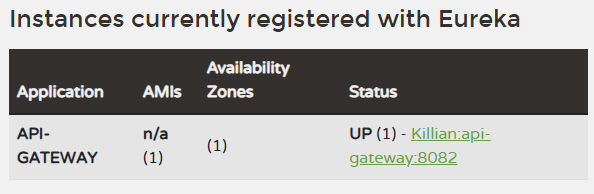

docker network create keycloak-network
docker run --restart unless-stopped -p 3306:3306 -d --name mariadb --net keycloak-network -e MYSQL_ROOT_PASSWORD=password -e MYSQL_DATABASE=keycloak -e MYSQL_USER=keycloak -e MYSQL_PASSWORD=password mariadb
docker run --restart unless-stopped -d -p 8080:8080 -e KEYCLOAK_USER=admin -e KEYCLOAK_PASSWORD=admin --name keycloak --net keycloak-network quay.io/keycloak/keycloak:12.0.3

